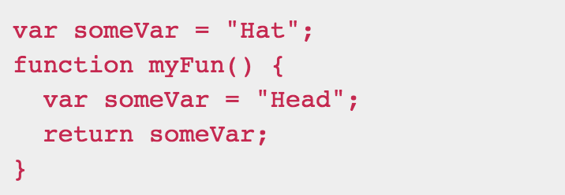

I found a new word “JavaScript” while I was answering to my question, “what is the most in-demand programing languages to learn?” There were a lot of different answers, but JavaScript and Java were often mentioned as important programing languages. I was total newbie to programing at the time; just took only ICS 110M. I kept searching the difference between JavaScript and Java, and found a key. “Java is to JavaScript as ham is to Hamster" Okay, then why do JavaScript and Java have similar names?

## Believe It or Not
According to Fossbytes, JavaScript had changed its name often such as ECMAScript, Mocha, Livescript, and finally became JavaScript that was inspired by popular programing language name, Java; JavaScript hitched a ride on the back of Java truck. 

## My First Impression of JavaScript
Through my first one-week experience with JavaScript, I realized that it is difficult to learn if I study in same way I did for Java and C++ languages. JavaScript is simple, sometimes it is too simple, so I question to myself ‘am I doing right?” I also throw into confusion because JavaScript is not following the such general rules I used to follow in Java. 
Using var keyword is an example, and the code as below is from freeCodeCamp.  

   

The function will return “Hat” in Java and “Head” in JavaScript unless let or const keywords are used instead of var keyword. JavaScript is flexible because it does not care data type and scope of the variable. So, I think that the coding in JavaScript can be easy, but also can be risky to make a messy code. The truth is JavaScript takes a shortcut.

## Athletic Software Engineering
When I heard about WODS on the first day of this class, it brought me fear. I wonder if I survive to the last through all the pressures such as new style test in limited time, JavaScript the programing language I never learned before, new school, and myself who is a slow starter. However, there are some student life supports such as a free JavaScript practice online website FreeCampCode, a pair WOD practice during the class, and Danny’s WODs session. In my opinion, WODs will be painful, but it will be great experience with programing. Studying is not just memorizing concepts and getting an A. I want to gain knowledge more and know hot to apply it to real life. I believe WODs will train me better. I looking forward to see me in  the future who will be not afraid of stressful code interview.

Reference. 
1. https://fossbytes.com/javascript-name-why-java
2. https://learn.freecodecamp.org/javascript-algorithms-and-data-structures/basic-javascript/global-vs--local-scope-in-functions

