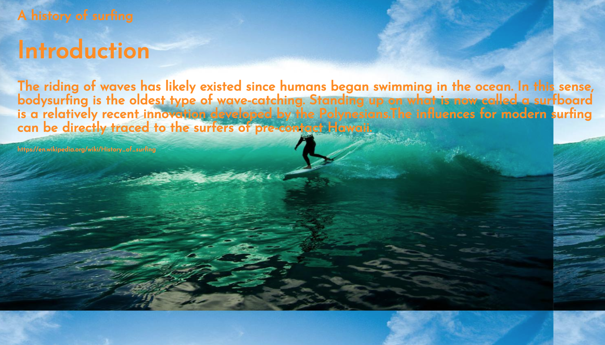
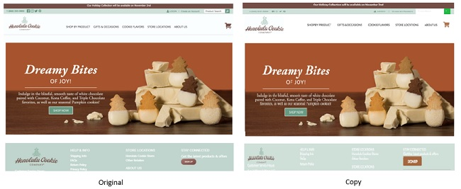

 Almost 10 days ago, I was working with my classmate to create a VERY simple page that was called “a history of surfing.” We were allowed to use only HTML and CSS, and the page had to have a surfing related background image for the entire page, a short paragraph, and some pictures in divided sections. My classmate and I worked for approximately 30 minutes and got the result as below. (sigh)

  

 

# Facing white blank wall 

 Using HTML and CSS alone to create a webpage is painful because you start from scratch and need to know them to use. Especially, you do not have any sense of the designs or the skills of HTML/CSS, you are already overwhelmed at the beginning. If we spend a lot of time and a lot of efforts and receive the incomplete unsatisfied outcome as mine above, it is definitely not productive. We better get some help to develop your works.

# Semantic UI 

 Semantic UI is a development framework that provides us the ability to build incredible websites and applications, and its syntax is from natural language so that leaning Semantic UI is easier than leaning other programing languages. Semantic UI provides many options that helps to create outstanding designs with various examples of use. For example, you can adjust the size of image without using exact numbers of width and height; just use English adjectives such as small, big, huge in class name to set the size.

# Copycat Activities
* Brandy Melville
 
  <image class="ui center image" src="../images/ui_copycat1.jpg">
   
* Honolulu Cookie Company
 
  

# Overall impression

For past one week, I had an experience with semantic UI, and it caught my interest. It was surprisingly easy and simple to create a high quality projects. While I was looking for nice looking websites and imitating them, I naturally learned Semantic UI. It also become good practices how to layout components for effective user interface. Now, I can make better "history of surfing" webpage in 30 mins with Semanctic UI. Semantic UI is the best tool that makes possible to copy fabulous websites and designs.

Semantic Website: https://semantic-ui.com

