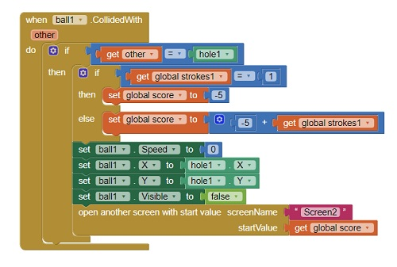

Mini golf is the first simple game app that I created using MIT App Inventor 2 through the ICS 110M, Introduction to programming. This golf game consists of three holes, and each hole contains one obstacle. The ball speed goes down when it hits an obstacle or bounces on edges. Each stroke that user flings the white ball toward the hole is counted to calculate the score. When the ball goes into (black) hole, a hole is over and indicates the final score.

 

As a newbie who was never took any programing class before, there were two challenging parts; one is how to control the movement of the white ball, and another one is how to score at the end. First of all, I used clock component to control the behavior of the ball if its speed is faster than zero, then reducing the speed. In real life, the rolling ball will slow down and stop, so that I made the ball will stop after user flings the ball. For the second part, I used a global variable to hold the stroke count that goes up by one for each user’s fling. When each hole is over, the stroke count sends its value to next hole and sets the stroke count to zero. On next hole, a new variable holds the value sent from previous hole, and keeps adding up the strokes. On final hole, the final score is represented.

  

