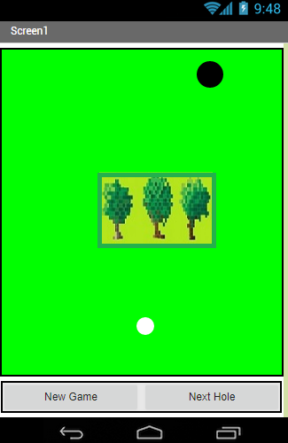

Mini golf is the first simple game app that I created using MIT App Inventor 2 through the ICS 110M, Introduction to programming. This game consists of three holes, and each hole containes one obstacle. The user flings the white ball toward the hole, and each stroke is counted to represent score. The ball is flung and its speed goes down if it hits obstacle or bounce on edges. The ball goes into a hole, and user can move to next hole. After three holes are done, it indicates the total score of three holes and button to choose close or play again.

